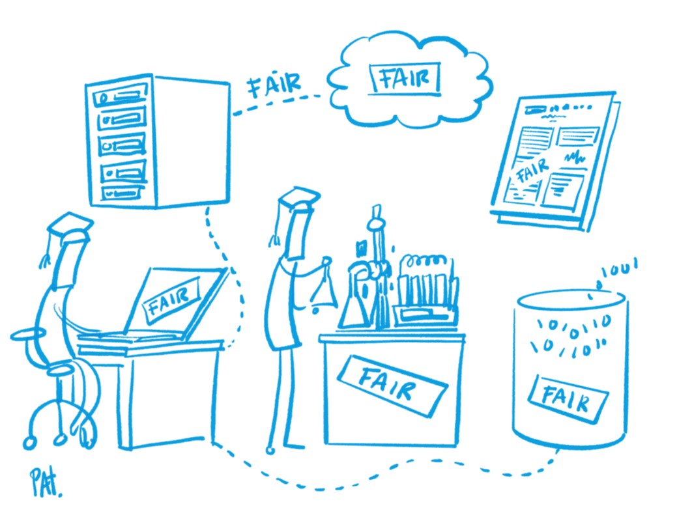

<!--

author:   Central Research Data Management of Kiel University
email:    fdm@rz.uni-kiel.de
version:  0.1.0
language: en
narrator: UK English Female

icon:     images\cau-norm-en-lilagrey-rgb.png

logo:     https://git-scm.com/images/branching-illustration@2x.png

comment:  Presentation for a 2h workshop "Introduction to Research Data Management" for PhDs

script:   https://cdn.jsdelivr.net/npm/mermaid@9.1.1/dist/mermaid.min.js

@mermaid
<script run-once="true" modify="false">
mermaid.initialize({});

var svg = mermaid.render('io9wuwzxt',`@0`.replace(/\\n/g, "\n"),
function(g) {
    return true;
})

"HTML: " + svg
</script>
@end

script:   https://s.plantuml.com/synchro2.min.js

@plantUML : @plantUML.exec(svg,```@0```)

@plantUML.svg: @plantUML.exec(svg,```@0```)

@plantUML.png: @plantUML.exec(png,```@0```)

@plantUML.exec
<script run-once modify="false">
function draw(type, code, counter = 10) {
  try {
    let s = unescape(encodeURIComponent(code));
    var arr = [];
    for (let i = 0; i < s.length; i++) {
      arr.push(s.charCodeAt(i));
    }
    let compressor = new Zopfli.RawDeflate(arr);
    let compressed = compressor.compress();
    let dest = "https://www.plantuml.com/plantuml/" + type + "/" + encode64_(compressed);
    send.html("")
    send.stop()
  } catch(e) {
    if (counter > 0) {
      setTimeout(draw(type, code, counter - 1), 100)
    } else {
      send.stop()
    }
  }
}

draw("@0", `@1`)
</script>

<span>

</span>
@end

@plantUML.eval
<script>
function draw(type, code, counter = 10) {
  try {
    let s = unescape(encodeURIComponent(code));
    var arr = [];
    for (let i = 0; i < s.length; i++) {
      arr.push(s.charCodeAt(i));
    }
    let compressor = new Zopfli.RawDeflate(arr);
    let compressed = compressor.compress();
    let dest = "https://www.plantuml.com/plantuml/" + type + "/" + encode64_(compressed);
    console.html("")
    console.log(dest)
    send.lia("LIA: stop")
  } catch(e) {
    if (counter > 0) {
      setTimeout(draw(type, code, counter - 1), 50)
    } else {
      send.lia("LIA: stop")
    }
  }
}

draw("@0", `@input`)
""
</script>
@end

-->

# Welcome

>**Thilo Paul-Stüve, Britta Petersen, Linda Zollitsch**
>
>Central Research Data Management of Kiel University
>
>**Disclaimer**: Please note that you are leaving the CAU pages once you open this presentation in your browser. This presentation includes links to other third party websites and services. When you click on these links you will leave this presentation and will be redirected to the respective another websites. These sites are not under our control.
>
>RDM@CAU is not responsible for the content of linked third party websites. Please be aware that the security and privacy policies on these sites may be different than CAU policies, so please read third party privacy and security policies closely.
>
> To see this document as an interactive LiaScript rendered version, click on the
> following link/badge:
>
> [](https://liascript.github.io/course/?https://raw.githubusercontent.com/LindaZollitsch/RDM-ZKE/main/rdm_LZ_v1.md#1)
>
> If you need help, feel free to ask us any questions:
>
> [fdm@rz.uni-kiel.de](mailto:fdm@rz.uni-kiel.de)
>
> ____________________________________________
>
>  This work is licensed under a [Creative Commons Attribution 4.0 International License](https://creativecommons.org/) with exception of the used material from other copyright holders.

<div style="page-break-after: always;"></div>


## Goals today

-----

At the end of the workshop you can…


<div style="float:right; width:30%;">
  
  <sub><span style="text-align: right;">Source: Cleo Michelsen</span></sub>
</div>


- describe the research data lifecycle.

- explain the importance of FAIR.

- explain the importance of documentation and can describe what metadata are.

- describe data formats.


<div style="page-break-after: always;"></div>

## Movie time!📽️😀

{{0-1}}
****************

<iframe width="560" height="315" src="https://www.youtube.com/embed/66oNv_DJuPc" title="YouTube video player" frameborder="0" allow="accelerometer; autoplay; clipboard-write; encrypted-media; gyroscope; picture-in-picture; web-share" allowfullscreen></iframe>


****************

{{1}}
****************

>__Let´s discuss!__
><!--
style="width: 20%; max-width: 800px; float:right"
title="working"
onclick="alert('working');"
-->
> Think about your own projects and recent work. Do scenes in the video look familiar to you?
>

****************

<div style="page-break-after: always;"></div>


## Research data management

### Research Data

{{0-1}}
********************************************************************************

What is research data?

********************************************************************************


{{1}}
********************************************************************************
> _‘In short data means whatever is necessary to validate or reproduce your research findings, or to gain a richer understanding of them.’_
>
>[University of Edinburgh Research Data Service](https://www.ed.ac.uk/information-services/research-support/research-data-service/research-data-management)

**********

{{2}}
***********
> _‘Any information you use in your research.‘_
>
>[University of Camebridge PrePARe Project](https://www.repository.cam.ac.uk/handle/1810/243750)

************

{{3}}
***************
> _‘All researchers work with data and/or datasets, but what you call data will depend on your discipline. As a humanities scholar you might talk about your primary sources or texts. If your research is in a social science, you may think in terms of survey results, interviews and statistics. You will probably have different terms again for the outputs of your experiments and observations if you are a scientist.’_
>
>[Monash University Library Data Management Brochure](https://www.monash.edu/__data/assets/pdf_file/0010/185869/data-management-brochure.pdf)

**************

<div style="page-break-after: always;"></div>

### Examples for Research Data
 <!-- width="350px" align="right" -->

- Audio and video recordings
- Diaries
- Geographic information system (GIS) data
- Laboratory and field notebooks
- Model, script and research software code
- Pictures and figures
- Questionnaires and codebooks
- Samples and artifacts
- Sensor data
- Sequence data
- Spectra
- Text and spreadsheet documents
- Text corpora and annotations
- Topography data
- Transcripts

<div style="page-break-after: always;"></div>

### Research Data Management

{{0}}
****************

What is research data management?

****************

{{1}}
****************
> ‘Research data management is an explicit process covering the creation and stewardship of research materials to enable their use for as long as they retain value.’
>
>[DCC Glossary](http://www.dcc.ac.uk/digital-curation/glossary#R)

****************

{{2}}
****************
> ‘Research Data Management (RDM) is the methodical handling of the information produced or re-used during the course of academic research.’
>
>[University of Edinburgh Research Data Service](https://www.ed.ac.uk/information-services/research-support/research-data-service/research-data-management)

******************

## Research data lifecycle

<center>
{{0-1}}
************

 <!-- width="500px" -->

************
</center>

<div style="page-break-after: always;"></div>

{{1-2}}
************
**Planning**:

* How do you plan to create data?
* Will data be reused? How is the data available?
* Which data types, in terms of data formats (e.g. image data, text data or measurement data in tables) are created?
* What volume of data can be expected?
* What legal and ethical aspects need to be taken into account?
* Who is responsible (for what)?
* Which analyses are planned? What requirements must the data meet in order to be analysed as planned? What kind of software environment will you need?

************

{{2-3}}
************
**Collection and analysis**:

* Which (digital) methods and tools (e.g. software) are required collect and safe the (raw) data?
* What measures are taken to ensure high quality of the data?
* What approaches are taken to document all your work in a comprehensible manner?
* Which digital methods and tools (e.g. software) are required to read, use and analyse the data?
* How and where will the data be stored during the project?
* What is your back up strategy?
* How will the security of sensitive data be guaranteed during the project (access and usage management)?

************

{{3-4}}
************
**Archiving & publication**:

* What legal conditions need to be considered in regard of publishing your research data?
* What ethical conditions need to be considered in regard of publishing your research data?
* Are there any effects or restrictions to be expected with regard to publication or accessibility of the data?
* How are usage and copyright aspects as well as ownership issues taken into account?
* Are there any important scientific codes or professional standards that should be taken into account?

************

{{4-5}}
************
**Re-use**:

* Which data is particularly suitable for re-use?
* What criteria are used to select research data in order to make it available for re-use by others?
* Do you plan to archive your data in a suitable infrastructure?
* Are there embargo periods?
* When can the research data expected to be used by third parties?

************

## Data organisation
{{0-1}}
****************

<div style="text-align:center">
><p style="color:#9a047f">**It may seem trivial, but structured folder and file naming is a first step in research data management!**</p>
</div>

<center></center>

<div style="text-align:center">
<P><SMALL>https://xkcd.com/1459. Shared under CC-BY-NC License</SMALL></P>
</div>

<div style="page-break-after: always;"></div>
****************

{{1}}
****************
>* Research data management fosters to improve findability and traceability of research data and to avoid data loss with the aim of increasing the (person-independent) **re-usability** of research data.
>
>* **The first person to want to re-use your own data may be yourself**! Store, name and document your own data in such a way that you can find, understand and re-use it as easily as possible.
>
>* Always store, name and document your data in such a way that you minimise the risk of data loss.

****************

### General notes

{{0-3}}
*****************

- **Never touch raw data! Always keep your raw data unchanged in a separate folder**.

********************************************************************************

{{1-3}}
********************************************************************************

- Try to find ‘speaking’ names for folders and files ➞ no ‘fantasy names’ 🦄, no random character strings

- Develop a standardised scheme and a logical structure

  - for both folder and file names.

  - Folders in hierarchical order with the most important first.

  - Ensure a maximum path length of 256 characters.

********************************************************************************

{{2-3}}
********************************************************************************
- Follow [***ISO 8601***](https://en.wikipedia.org/wiki/ISO_8601) for dates and times

  - Date and time, e.g. YYYY-MM-DD-hh-mm-ss or YYYYMMDDhhmmss

********************************************************************************

{{3-4}}
********************************************************************************

- Avoid spaces and special characters (including special letters, such as ö, ä, ü, å, â, é, ş, ž).

  - The following characters in particular should **NOT** be used in folder or file names:

    - less than: <

    - greater than: >

    - colon: :
    
    - double quotation mark: “
    
    - slash: /
    
    - backslash: \
    
    - vertical bar or pipe: |
    
    - question mark: ?
    
    - asterisk: \*

  - The only unproblematic special characters in folder or file names are underscore (_) and hyphen/minus (-)

********************************************************************************

{{4-6}}
********************************************************************************

- Prefix consecutive numbers with a sufficient number of zeros (e.g. 001 for numbering from 1 to 100)

********************************************************************************

{{5-6}}
********************************************************************************

- Use only one dot per file name -> between the file name and format suffix (e.g. filename.txt)

********************************************************************************

{{6}}
********************************************************************************

- ***Document*** your folder structures as well as the naming conventions and abbreviations used!

  - Readme.md

**********************************************************

<div style="page-break-after: always;"></div>

### Examples

{{0-1}}
********************************************************************************

**Example for a folder hierarchy**

<center>
  
    <sub style="text-align: right;">Provided by Oliver Nakoinz</sub>
</center>

********************************************************************************

{{1}}
****************************************

>**Example for a file name following a naming convention**
>
>[Project name]\_[Approach]\_[Location]\_[Person-ID]_[Date].[Format-Suffix]
>
>Rebel-Hunting\_Interview\_DS-1-Orbital-Battle-Station\_Organa\_1976-05-25.mp4

****************************************


## File formats

**Choosing file formats**

>-> Non-Proprietary, unencrypted, uncompressed and commonly used
>
>-> Open-standard-compliant, documented and royalty-free

| Data Type    | Recommended | Trade-off Matter | Not Recommented |
| ------------ | ----------- | ---------------- | --------------- |
| Tabular      | CSV, TSV, ODS| XLSX, SPSS portable| XLS, SPSS |
| Textual      |TXT, MD, HTML, ODT | DOCX, RTF, PDF/A | DOC, PDF, PS |
| Presentation | ODP, HTML   |  PPTX            |   PPT           |
| video        |MP4, MKV, OGG|  WEBM            | WMV, MOV, QT, Flash|
| Audio        | MP4, FLAC, WAV, OGG | MP3, AIF |                 |
| Image        | TIFF, PNG   |  BMP, JPG        |   PSD, GIF      |
| Vector       |  SVG        |                  |     AI          |
| Generic      |  XML, JSON, RDF |              |                 |
| Container    | Bagit, Frictionless, Data Package| ZIP, TAR |      |

<div style="page-break-after: always;"></div>


## Data documentation

{{0-1}}
*********

>**Group work**:
>
><!--
style="width: 20%; max-width: 800px; float:right"
title="group-work"
onclick="alert('Let´s work together!');"
-->
>
> You are working in a research group working on the ecology of forests and take over data from a previous project: <A HREF="images/average_d.xlsx" download>average_d.xlsx</A>
>
> * Speculate what kind of data it could be.
>
> Discuss and take notes
>
> * Apart from the data itself, what information do you need to be able to work with a dataset?
>
> * What do you notice in regard of data quality?

*********


{{1}}
*********

<div style="float:left; width:60%;">
  <p>

  **A good data documentation should include**

  - Information on the collection of data

      - Methods, units, time periods, locations, technique used, etc.

  - Structure of the data and their mutual relationships

  - Explanation of variables, labels and codes

  - Differences between different data set versions

  - Measures for data cleaning

  - Information on access and terms of use

      - Licensing

  - Ideal world

      - Description of the research undertaking

        - Goals

      - Hypotheses

</p>


**************


### Metadata

{{0}}
*********

<big>What is Metadata?</big>

*********

{{1}}
*********
 <!--
style="width: 20%; max-width: 800px; float:right"
-->

Metdata is...

- Data about data

- Administrative data

  - Information on the management of the data

  - Mostly generic

- Subject data

  - Individual aspects or data sets in more detail

  - Structured with respect to the research discipline

- Generic standards

  - [DataCite Metadata Schema](https://schema.datacite.org/)

  - [Dublin Core Metadata Initiative](https://dublincore.org/)

- Discipline-specific standards

  - [Metadata Standards Directory](https://rdamsc.bath.ac.uk/)

*******

<div style="page-break-after: always;"></div>


## Back up & long-term storage


> **Recommendations for your back up**
>
>- At least 3 copies of a file
>- On at least 2 different media
>- At least one of which is remote
>- Test data recovery at the beginning and at regular intervals.


{{1}}
****************
How do your store your (sensitive) data?
****************

{{2}}
****************
> **Protect your (sensitive) data**:
>
>- Hardware (e.g. separate lockable room).
>- File encryption
>- Password security
>- At least two people should have access to your data

*****************

<div style="page-break-after: always;"></div>

### Back up vs. long-term storage

| Back up                                                                          | Long-term storage             |
| -------------------------------------------------------------------------------- | ----------------------------- |
| Automatic backup of all data   | Storage of only selected data |
| All versions                                                                     | Final version only            |
|   to prevent data loss <br>(technical, e.g. defective, <br>or human, e.g. accidentally deleted) | Integrity backup <br> (e. g. regular check for modified or damaged data, <br>file system consitency)      |
|                                                                                  | Long-term storage             |
|                                                                                  | Searchability                 |

<div style="page-break-after: always;"></div>


## Licenses
{{0-1}}
*******************
- Licenses regulate conditions of subsequent use of published data.
- Free licenses allow the use, redistribution and modification of copyrighted works

  - are usually available for free use and only need to be linked to
  - Prerequisite is that you are the copyright holder


Selection of the license depends on the type of data:

  - e.g. Creative Commons (CC) licenses for articles, monographs, images, etc.

  - Open-Database-License (ODbL) for DB or CC starting with version 4

  - General Public License (GNU) for software

- If no license is granted, the stricter copyright applies, as far as applicable to data

***********

<div style="page-break-after: always;"></div>

{{1-2}}
******************
> **CC-Licenses**

><div style="width:100%;">
  
</div>


*********************

<div style="page-break-after: always;"></div>

{{2}}
******************
**Take care!**

>$$
no\,license
\not =
free\,license
$$

********************

<div style="page-break-after: always;"></div>


## FAIR Data Principles

{{0-1}}
****************

<div style="width:50%;">
  
  <sub><span style="text-align: right;">Illustration: Patrick Hochstenbach in Engelhardt, Claudia et. al. (2021)</span></sub>
</div>

****************

{{1-2}}
> An important goal of research data management is to keep data 
>
>🔍 **F**indable,
>
>🔐 **A**ccessible,
>
>🔗 **I**nteroperable and
>
>♻️ **R**eusable
>
>in the ~~long term~~ and ~~independent of individuals~~.


<div style="page-break-after: always;"></div>

{{2}}
>**F**indable

{{3-4}}
****************
The first step in (re)using data is to find them. Metadata and data should be easy to find for both humans and computers. Machine-readable metadata are essential for automatic discovery of datasets and services, so this is an essential component of the FAIRification process.

F1. (Meta)data are assigned a globally unique and persistent identifier

F2. Data are described with rich metadata (defined by R1 below)

F3. Metadata clearly and explicitly include the identifier of the data they describe

F4. (Meta)data are registered or indexed in a searchable resource

***************

{{2}}
>**A**ccessible

{{4-5}}
***********************
Once the user finds the required data, the user needs to know how data can be accessed, including authentication and authorisation.

A1. (Meta)data are retrievable by their identifier using a standardised communications protocol

A1.1 The protocol is open, free, and universally implementable

A1.2 The protocol allows for an authentication and authorisation procedure, where necessary

A2. Metadata are accessible, even when the data are no longer available

******************

{{2}}
>**I**nteroperable

{{5-6}}
**********************
The data usually needs to be integrated with other data. In addition, the data needs to interoperate with applications or workflows for analysis, storage, and processing.

I1. (Meta)data use a formal, accessible, shared, and broadly applicable language for knowledge representation.

I2. (Meta)data use vocabularies that follow FAIR principles

I3. (Meta)data include qualified references to other (meta)data

**********************

{{2}}
>**R**eusable

{{6-7}}
***************
The ultimate goal of FAIR is to optimise the reuse of data. To achieve this, metadata and data should be well-described so that they can be understood, replicated and/or combined in different settings.

R1. Meta(data) are richly described with a plurality of accurate and relevant attributes

R1.1. (Meta)data are released with a clear and accessible data usage license

R1.2. (Meta)data are associated with detailed provenance

R1.3. (Meta)data meet domain-relevant community standards

**************

<div style="page-break-after: always;"></div>


## Take-Away Messages

> Practical Take-Away Messages

1. <p style="color:#9a047f">**Document your data**</p>

{{1-2}}
************
>- Use documented naming and versioning conventions
>
>- document changes
>
>- think about metadata necessary to understand your data

*************

2. <p style="color:#9a047f">**Formats**</p>

{{2-3}}
************
>  - __Generic and open standard file formats__ last longer than proprietary file formats
>
>    - Open Document Format (ODF)
>
>    - Comma separated values (CSV)
>
>    - Raw text files (TXT, MD)
>
>  - __Data container formats__ for __exchange, archival and publication__, e.g., [BagIt](https://tools.ietf.org/html/rfc8493), [Frictionless Data](https://frictionlessdata.io/)

*************

3. <p style="color:#9a047f">**Storage**</p>

{{3-4}}
**********
>  - __Central infrastructure with backup__ for storage
>
>  - Desktop and laptop for work on current research data only
>
>  - Systematic file and folder naming and hierarchy
>
>  - Provide _Readme_ files
>
>  - Data Management Middleware for handling data and metadata, e.g., [iRODS](https://irods.org/)
>
>  - DFG [Guidelines for Safeguarding Good Research Practice](https://www.dfg.de/en/research_funding/principles_dfg_funding/good_scientific_practice/index.html)  require 10 years of preservation at least!

************

4. <p style="color:#9a047f">**Publication**</p>

{{4-5}}
************
>  - Discipline-specific Repositories with specific metadata support
>
>    - [re3data: Registry of Research Repositories](https://www.re3data.org/)
>
>  - National or international initiatives
>
>    - NFDI (work in progress)
>
>    - [European Open Science Cloud Services](https://marketplace.eosc-portal.eu/services/c/sharing-discovery)
>
>  - Institutional Data Repository: [opendata@uni-kiel](https://opendata.uni-kiel.de/)
>
>  - Generic Repositories
>
>    - [Zenodo](https://zenodo.org/)

************

5. <p style="color:#9a047f">**Licensing**</p>

{{5-6}}
**************
>  - [Creative Commons](https://creativecommons.org/): data with a necessary creation height; ideally CC0 or CC BY
>
>- [Open Data Commons](https://opendatacommons.org/): databases, raw data

**********

<div style="page-break-after: always;"></div>


## CAU contacts


<div style="float:right; width:40%">
  
</div>

**RDM contacts at CAU**:

https://www.fdm.uni-kiel.de/de/team

<div style="page-break-after: always;"></div>

## Thank you! :-)

Please take care of your data! 🌼
---
